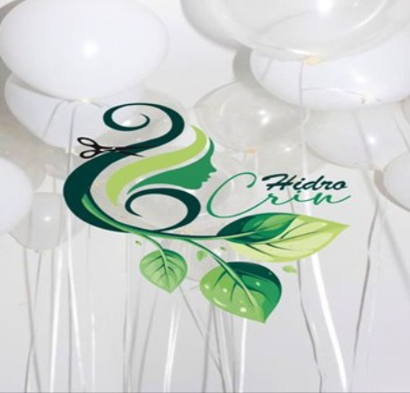

# 🌱 Hidrocrin - Alfombras de Cabello Reciclado para Agricultura Sostenible



## 📋 Descripción

Hidrocrin es un proyecto innovador de economía circular que transforma residuos de peluquerías en alfombras ecológicas para la agricultura. Nuestra solución combate la sequía mediante la retención de agua y nutrientes en el suelo, promoviendo prácticas sostenibles y apoyando a pequeños agricultores.

**Características principales:**
- 🌿 Transforma cabello desechado en recursos valiosos
- 💧 Retiene hasta 5 veces su peso en agua
- 🌾 Libera nutrientes gradualmente al suelo
- ♻️ 100% biodegradable y natural
- 🌍 Promueve la economía circular

## 🚀 Tecnologías Utilizadas

- **React 19** - Biblioteca de interfaz de usuario
- **TypeScript** - Tipado estático para JavaScript
- **Vite** - Herramienta de construcción rápida
- **Tailwind CSS 4** - Framework de estilos utility-first
- **React Router DOM** - Navegación entre páginas
- **GSAP** - Animaciones fluidas
- **Lucide React** - Iconos modernos
- **Vercel** - Deployment y hosting

## 📱 Optimizaciones Responsive

Este proyecto ha sido optimizado para ofrecer una experiencia excepcional en todos los dispositivos:

### ✅ Dispositivos Móviles (320px - 640px)
- Navegación adaptativa con menú hamburguesa
- Tipografía escalable y legible
- Imágenes y videos optimizados
- Espaciado y padding ajustados
- Botones y elementos táctiles de tamaño adecuado

### ✅ Tablets (640px - 1024px)
- Diseño de grillas responsive (2 columnas)
- Espaciado intermedio optimizado
- Navegación fluida entre secciones

### ✅ Desktop (1024px+)
- Diseño completo con todas las características
- Grillas de 3-4 columnas
- Animaciones y efectos visuales avanzados

## 🛠️ Instalación y Configuración

### Prerrequisitos
- Node.js 18+ 
- pnpm (recomendado) o npm

### Pasos de instalación

```bash
# Clonar el repositorio
git clone https://github.com/tu-usuario/web-hidrocrin.git

# Navegar al directorio
cd web-hidrocrin

# Instalar dependencias
pnpm install

# Iniciar servidor de desarrollo
pnpm dev

# Construir para producción
pnpm build

# Previsualizar build de producción
pnpm preview
```

## 📂 Estructura del Proyecto

```
web-hidrocrin/
├── public/
│   └── assets/
│       └── images/          # Imágenes del proyecto
├── src/
│   ├── assets/
│   │   └── images/          # Exports de imágenes
│   ├── components/
│   │   ├── layout/          # Componentes de layout
│   │   │   ├── AnimatedNav.tsx
│   │   │   ├── Footer.tsx
│   │   │   └── PageLayout.tsx
│   │   ├── sections/        # Secciones de páginas
│   │   │   ├── ActivityCalendar.tsx
│   │   │   └── HidrocrinLanding.tsx
│   │   └── ui/              # Componentes UI reutilizables
│   ├── pages/               # Páginas del sitio
│   │   ├── Historia.tsx
│   │   ├── SobreNosotros.tsx
│   │   └── TerminosYCondiciones.tsx
│   ├── lib/                 # Utilidades
│   ├── App.tsx
│   ├── main.tsx
│   └── index.css
├── vercel.json              # Configuración de Vercel
├── vite.config.ts           # Configuración de Vite
└── tailwind.config.js       # Configuración de Tailwind
```

## 🎨 Características de Diseño

### Paleta de Colores
- **Verde Primario**: `#10b981` (Emerald 600)
- **Verde Claro**: `#14b8a6` (Teal)
- **Fondo**: Gradientes suaves de emerald y teal

### Tipografía Responsive
- **Móviles**: text-xs a text-base
- **Tablets**: text-sm a text-lg
- **Desktop**: text-base a text-xl

## 🌐 Deployment en Vercel

El proyecto está configurado para deployment automático en Vercel:

1. **Archivo vercel.json** configurado con rewrites para SPA
2. **Headers de seguridad** optimizados
3. **Cache para assets** configurado
4. **Optimización automática** de imágenes y código

### Variables de entorno (si aplica)
```env
# Agregar si es necesario
VITE_API_URL=tu_api_url
```

## 🔧 Scripts Disponibles

```bash
# Desarrollo
pnpm dev              # Inicia servidor de desarrollo

# Producción
pnpm build            # Construye para producción
pnpm preview          # Previsualiza build de producción

# Calidad de Código
pnpm lint             # Ejecuta ESLint
```

## 📊 Optimizaciones SEO

- ✅ Meta tags optimizados
- ✅ Open Graph para redes sociales
- ✅ Twitter Cards
- ✅ Favicon personalizado
- ✅ Sitemap (próximamente)
- ✅ Estructura semántica HTML5

## 👥 Equipo

- **Carolina Velásquez** - Co-fundadora
- **Viviana González** - Co-fundadora

## 📞 Contacto

- **Email**: hidrocrin.dosmundo@gmail.com
- **Instagram**: [@hidrrcrin](https://www.instagram.com/hidrrcrin)
- **Facebook**: [Hidrocrin Dos Mundos](https://www.facebook.com/share/1CiJxG658X/)
- **Teléfono**: 975266692 – 956113831

## 📄 Licencia

© 2025 Hidrocrin. Todos los derechos reservados.

---

**Hecho con 🌿 para un futuro sostenible**

Proyecto de Economía Circular | Región de Los Lagos, Chile
